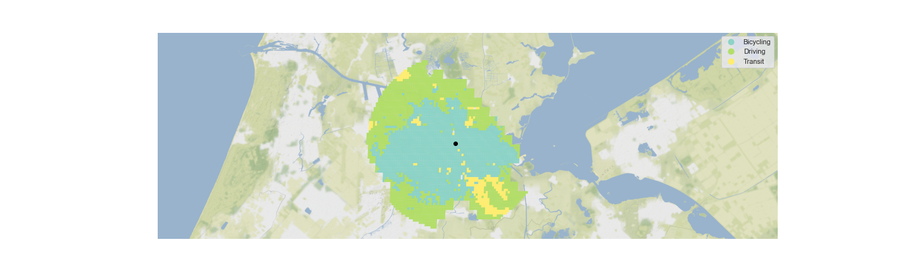

# Dataset of Urban Transport Times

This file is still a work-in-progress! 

## Online Platform

Go to the most recent online version at https://urbantransporttimes.online.

## Datasets: description

Just want to get the shapefiles? Download from [the latest release](https://github.com/idegeus/UrbanTransportTimes/releases/latest). 

#### Graphs and aggregated files:

| Path                         | Description                                                  |
| ---------------------------- | ------------------------------------------------------------ |
| graphs/heatmaps              | Heatmaps of individual modes per city (duration of route to center point) |
| graphs/fastest-transport     | Fastest transport mode to the center per cell (for both rush-hour and midday) |
| csv/above-eucl-distance.csv  | The weighted average of the route distance minus the euclidean distance ("as the crow flies") |
| csv/pop-reached-30-min.csv   | Population percentage reached within 30 minute per transport mode |
| csv/rel-pop-fastest-mode.csv | Population percentage for who a specific mode is the fastest choice to che center. |
| shapefiles/complete-dataset  | Both GeoPackage and ESRI-Shapefile bundles with the complete route details per cell as aggregated from the collected routes |
| shapefiles/th-distance-stats | Complete dataset aggregated to show population weighted route averages when radiating out of the city center. |